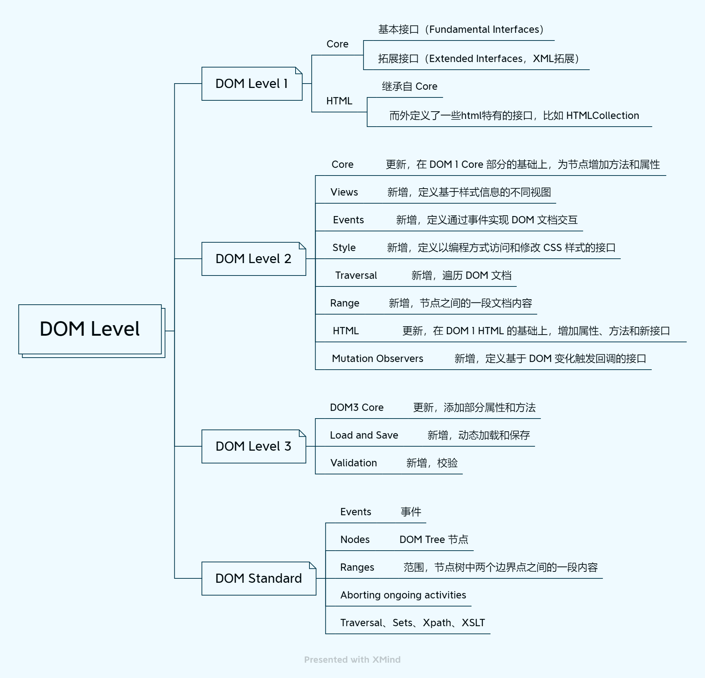

DOM 全称 Document Object Model（文档对象模型），定义了和平台无关的事件、节点树的模型等内容，它只是一种模型，DOM 规范是对这种模型的描述。它告诉我们该如何对文档进行访问和修改。这种模型适用于 HTML 和 XML 类型的文档。

DOM 模型用一个树结构来表示一个文档，树的每个分支的终点都是一个节点 (node)，每个节点都是包含属性和方法的对象 (objects)。DOM 的方法 (methods) 让你可以用特定方式操作这个树，用这些方法你可以改变文档的结构、样式或者内容。节点可以关联上事件处理器，一旦某一事件被触发了，那些事件处理器就会被执行。

前端平时常说的 DOM 对象其实是通过 JS 对 DOM 规范 (API) 中具体接口 (interface) 的一种实现，**DOM 对象就是 JS 对象，也是使用原型继承，也拥有 JS 对象的其他特点**。

DOM 曾经使用 Level 来命名，一直到 Level 3，标准文件维护在 [w3c 网站](https://www.w3.org/TR/?title=dom)。Level 4 时修改为 DOM Standard，维护在 [WHATWG 网站](https://dom.spec.whatwg.org/)。



DOM Standard 大致内容如下：

1. Infrastructure 介绍了 DOM 标准中的一些基本概念和术语
2. Events（事件）
3. Aborting ongoing activities（终止正在进行的活动）
4. Nodes（节点）
5. Ranges（范围）
6. Traversal（遍历）
7. Sets（DOMTokenList）
8. XPath（XML 路径语言）
9.  XSLT（XSL 转换）
10. Historical（历史：废弃的接口）

## 1. Infrastructure

**Trees**：

主要讲了树的定义、特征，以及节点的特征、节点间的关系。定义了后面几个章节使用到的一些名词。

- 所谓 tree 是一个有限层次的树形结构，遍历顺序为先序深度优先遍历；
- tree 中的节点都是对象，上有父节点 (parent)，下有子节点 (children)；
- 根节点 (root) 的 parent 是 null；
- 如果节点 A 是 B 的子节点 (child)，或者 C 是 B 的子节点 (child) 而 A 是 C 的子节点 (child)，那么称作 A 是 B 的后代元素 (descendant)；
- 当且仅当 A 是 B 的后代元素 (descendant) 时，节点 B 才称为节点 A 的祖先元素 (ancestor)；
- 当且仅当 A 与 B 拥有同一个不为 null 的父节点时，A、B 节点互称为兄弟节点 (sibling)；
- ......

**Ordered sets**：todo

**Selectors**：todo

**Namespaces**：todo

## 2. Events

在 Web 中，事件的作用是给对象 (object) 发送信号，通知对象某件事情（请求、交互等）的发生，对象通过 EventTarget 对象上的 addEventListener 方法来观察到事件的发生，通过 removeEventListener 方法来取消观察（Web 请求事件还可以通过 AbortSignal 的 abort() 方法取消观察）。

### 具体接口 (interface)

**Event**：事件对象。表示事件本身，Event 对象提供了一些属性和方法，包含了事件本身的各种信息。Event 本身也是构造函数，可以用来生成新的实例，所有的事件都是这个对象的实例。

```js
const event = new Event(type, options);

// 生成新实例
// options 支持三个字段：composed、cancelable、bubbles
const e = new Event('look', {'bubbles': true, 'cancelable': false})
```

- Event.type 事件类型，不分大小写
- Event.target 事件的原始触发节点
- Event.currentTarget 事件当前通过的节点
- Event.bubbles 是否可冒泡
- Event.eventPhase 事件流所处阶段，0 到 4 分别表示没事件、捕获阶段、在 target、冒泡阶段
- Event.cancelable 事件是否可取消
- Event.cancelBubble 读写，是否可冒泡，是 Event.stopPropagation() 的历史别名
- Event.composed 事件冒泡是否可以穿越 shadow dom 和常规 dom 的边界
- Event.defaultPrevented 是否调用过 event.preventDefault() 取消事件
- Event.returnValue 读写是否被取消，由 ie 引入为了兼容所以引入标准但不建议使用
- Event.timeStamp 事件创建时的时间戳，相对于网页加载成功开始计算
- Event.isTrusted 表示是由用户触发 (true) 还是脚本触发 (false)

**CustomEvent**：自定义事件对象。继承自 Event 对象，可自定义事件的信息，传递指定的数据。

```js
// 添加一个事件监听器
obj.addEventListener("cat", function(event) { console.log(event) })
// detail 表示自定义的数据
const customEvent = new CustomEvent("cat", { "detail":{ "cute":true }})
// 脚本触发事件
obj.dispatchEvent(customEvent)
```

**EventTarget**：一个用来接收事件、创建侦听器的对象。

由于 DOM 的节点都需要有接收事件的功能，所以 EventTarget 被设计在了 DOM 对象原型链的最末端。

EventTarget 主要有三个方法：

- addEventListener()：绑定事件的监听函数
- removeEventListener()：移除事件的监听函数
- dispatchEvent()：触发事件

:::tip 注意
dispatchEvent 方法触发的事件**同步执行**，用户触发的事件**异步执行**。
:::

## 3. Aborting ongoing activities（终止正在进行的活动）

Promise 内部没有提供取消机制，但有时我们又确实需要用到取消机制，所以 DOM 中提供了 AbortController 控制器对象，允许你根据需要中止一个或多个 Web 请求。

目前 Fetch API 已经实现了这个规范。下面是 Promise 中使用控制器对象的一个示例：

```js
const controller = new AbortController();
const signal = controller.signal;

startSpinner();

request({ ..., signal })
  .then(result => ...)
  .catch(err => {
    if (err.name === 'AbortError') return;
    showUserErrorMessage();
  })
  .then(() => stopSpinner());

// …

controller.abort();
```

## 4. Nodes

DOM 是一种访问和操作文档的 API。其中“文档”不仅限于 HTML 文档，适用于任何标记语言的文档。每个文档都可以表示为一个节点树 (Node Tree)，树中的一些节点 (Node) 可以有子节点 (children)，没有子节点的称为叶子节点 (leaves)。

### Node Tree

节点对象 (Node) 组成的 tree 就叫 Node Tree。

节点有以下几种类型：

- Document
  - 所包含的节点在 Node Tree 中需要按以下顺序排列
  1. 零个或多个 ProcessingInstruction / Comment 节点。
  1. 零个或一个 DocumentType 节点.
  1. 零个或多个 ProcessingInstruction / Comment 节点。
  1. 零个或一个 Element 节点。
  1. 零个或多个 ProcessingInstruction / Comment 节点。
- DocumentFragment
- Element
  - 可包含零个或多个 Element / CharacterData 节点。
- DocumentType
- CharacterData
- Attr
  - 不能有子节点。

根节点类型不同，组成的 Node Tree 的类型也不同。

- **Document tree**：根节点 (root) 类型 document。
- **Shadow tree**：根节点 (root) 类型是 document。

### Mutation observers

### 具体接口 (interface)

**Node**：

**Document**：

**DocumentType**：

**DocumentFragment**：

**ShadowRoot**：

**Element**：

**CharacterData**：

**Text**：

**CDATASection**：

**ProcessingInstruction**：

**Comment**：

## 5. Ranges

StaticRange、Range 都表示一个 node tree 中有起点和终点的一段内容。通常用来选择和复制文档中的一段内容。

### Boundary points（边界点）

### 具体接口 (interface)

**AbstractRange**：

**StaticRange**：

**Range**：

## 6. Traversal

迭代和筛选 node tree。

### 具体接口 (interface)

**NodeIterator**：

**TreeWalker**：

**NodeFilter**：

## 7. Sets

### 具体接口 (interface)

**DOMTokenList**：

## 8. XPath（XML 路径语言）

XPath 的意思是 XML 路径语言。XPath 主要被用于 XSLT（XML 文档转换），也可用于定位文档元素。XPath 使用路径标识符通过层级结构来导航 XML 文档。它使用非 XML 语法，以致于它可以被用在 URIs 和 XML 属性值上。

### 具体接口 (interface)

**XPathResult**：

**XPathExpression**：

**XPathEvaluator**：

## 9. XSLT（XSL 转换）

XSL Transformations（XSLT）是一种用于将 XML 文档转换为其他 XML 文档的语言。

### 具体接口 (interface)

**XSLTProcessor**：

## 10. Historical（历史：废弃的接口）
