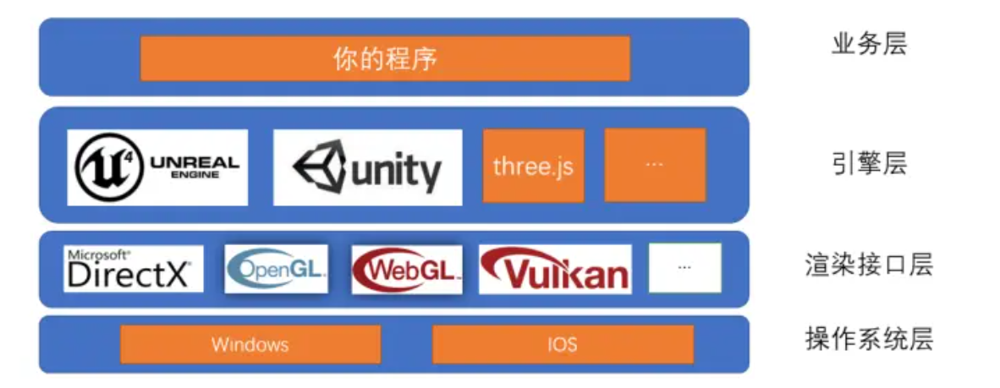
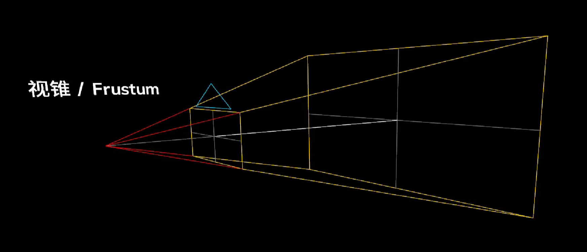
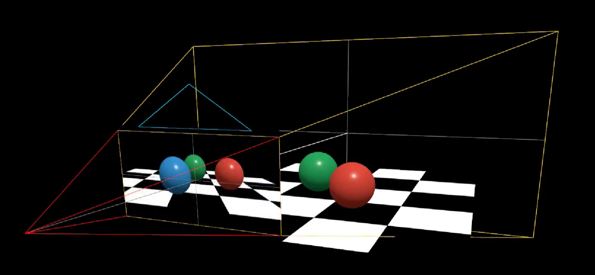
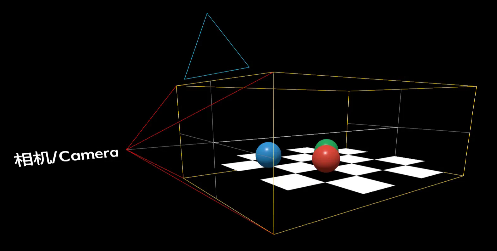

# Three.js

Three.js 是一个 JavaScript 三维渲染库，不是浏览器原生 Web API。它在 WebGL 等图形 API 之上提供场景图、相机、几何体、材质、灯光、动画和资源加载等抽象，让开发者把主要精力放在场景组织和视觉效果上。

学习 Three.js 时仍然需要理解坐标系、矩阵、纹理、光照和 GPU 资源生命周期。遇到性能、透明排序、精度或着色器问题时，这些底层知识决定了能否正确定位问题。

## 与 WebGL 的关系

Three.js 的常用对象最终会被渲染器转换为 WebGL 的缓冲区、纹理、状态和绘制命令：

| Three.js 抽象 | 底层含义 |
| --- | --- |
| `Scene`、`Object3D` | 场景图和层级变换 |
| `BufferGeometry` | 顶点属性、索引和 GPU Buffer |
| `Material` | 着色器程序和一组渲染状态 |
| `Texture` | GPU 纹理及采样配置 |
| `Camera` | 观察矩阵和投影矩阵 |
| `WebGLRenderer` | 资源管理、状态排序和绘制命令调度 |

Three.js 不会消除 GPU 的限制。Draw call、纹理尺寸、透明排序、浮点精度和上下文丢失等问题依然存在，只是由库提供了更易用的入口。

## 场景的基本组成

一个典型 Three.js 场景包含：

- **场景（Scene）**：场景图的根容器，组织物体、灯光和辅助对象；
- **相机（Camera）**：定义观察位置和投影方式；
- **几何体（BufferGeometry）**：保存顶点位置、法线、纹理坐标和索引；
- **材质（Material）**：定义表面颜色、纹理、光照响应和渲染状态；
- **物体（Mesh、Line、Points）**：把几何数据和材质组合为可渲染对象；
- **灯光（Light）**：为需要光照的材质提供光源信息；
- **渲染器（Renderer）**：遍历场景，排序对象并向图形 API 提交绘制命令。



一个场景可以有多个相机。每次调用 `renderer.render(scene, camera)` 时选择其中一个，也可以配合视口和裁剪区域实现小地图、分屏或画中画。

## 相机与视锥

### 透视相机

`PerspectiveCamera` 模拟近大远小的透视效果，适合普通三维场景。它的核心参数是垂直视野角、宽高比、近裁剪面和远裁剪面。

```js
const camera = new THREE.PerspectiveCamera(
  45,
  container.clientWidth / container.clientHeight,
  0.1,
  1000
)
```





近裁剪面应大于 0，并尽量避免把近、远裁剪面的比例设置得过大，否则深度缓冲精度会下降，产生表面闪烁（z-fighting）。

### 正交相机

`OrthographicCamera` 不产生近大远小的效果，常用于 CAD、二维地图、编辑器控件和固定尺寸的 UI 图层。它的视锥是长方体：



地图并不固定使用某一种相机。平面地图常用正交投影；带俯仰和透视效果的地图、地形及三维建筑则可以使用透视相机或等价的自定义投影矩阵。

## 几何体与可渲染对象

现代 Three.js 使用 `BufferGeometry` 表示几何数据。内置的 `BoxGeometry`、`SphereGeometry` 等类也都继承自 `BufferGeometry`。早期版本中的 `Geometry` 已经移除，不应再用于新代码。

```js
const geometry = new THREE.BufferGeometry()
geometry.setAttribute(
  'position',
  new THREE.Float32BufferAttribute([
    0, 1, 0,
    -1, -1, 0,
    1, -1, 0
  ], 3)
)
geometry.computeVertexNormals()
```

不同对象对应不同的图元语义：

| 对象 | 常见用途 |
| --- | --- |
| `Mesh` | 三角形网格、模型和表面 |
| `Line`、`LineSegments` | 线段和辅助线 |
| `Points` | 点云和粒子 |
| `Sprite` | 始终面向相机的图标或标签 |
| `InstancedMesh` | 大量共享几何体和材质的实例 |

## 材质与灯光

材质决定对象如何被着色。常见材质包括：

| 材质 | 特点 |
| --- | --- |
| `MeshBasicMaterial` | 不参与灯光计算，没有灯光也能显示 |
| `MeshLambertMaterial` | 漫反射效果，开销相对较低 |
| `MeshPhongMaterial` | 支持镜面高光 |
| `MeshStandardMaterial` | 基于物理的金属度/粗糙度工作流 |
| `MeshPhysicalMaterial` | 在标准材质上增加透射、清漆等效果 |
| `ShaderMaterial` | 使用自定义 GLSL 着色器 |

“没有灯光场景就会全黑”并不准确。`MeshBasicMaterial`、自发光材质、背景和自定义着色器不依赖场景灯光；Lambert、Phong、Standard、Physical 等光照材质则需要合适的灯光或环境贴图。

常用灯光有 `AmbientLight`、`HemisphereLight`、`DirectionalLight`、`PointLight`、`SpotLight` 和 `RectAreaLight`。灯光数量、阴影贴图尺寸和材质复杂度都会影响性能。写实场景通常还会配合 HDR 环境贴图与基于图像的光照。

## 最小示例

```js
import * as THREE from 'three'

const container = document.querySelector('#scene')
const scene = new THREE.Scene()
scene.background = new THREE.Color(0xf4f6f8)

const camera = new THREE.PerspectiveCamera(45, 1, 0.1, 100)
camera.position.set(0, 1.5, 4)

const renderer = new THREE.WebGLRenderer({ antialias: true })
renderer.setPixelRatio(Math.min(window.devicePixelRatio, 2))
container.append(renderer.domElement)

const geometry = new THREE.BoxGeometry(1, 1, 1)
const material = new THREE.MeshStandardMaterial({
  color: 0x2383e2,
  roughness: 0.55,
  metalness: 0.05
})
const cube = new THREE.Mesh(geometry, material)
scene.add(cube)

const light = new THREE.DirectionalLight(0xffffff, 3)
light.position.set(3, 4, 2)
scene.add(light)
scene.add(new THREE.HemisphereLight(0xffffff, 0x445566, 1))

function resize() {
  const width = container.clientWidth
  const height = container.clientHeight

  renderer.setSize(width, height, false)
  camera.aspect = width / height
  camera.updateProjectionMatrix()
}

resize()
window.addEventListener('resize', resize)

renderer.setAnimationLoop((time) => {
  cube.rotation.y = time * 0.001
  renderer.render(scene, camera)
})
```

`renderer.setSize(width, height, false)` 中的 `false` 表示不覆盖 Canvas 的 CSS 尺寸。真实组件中更适合使用 `ResizeObserver` 监听容器，而不是只监听窗口变化。

`setAnimationLoop()` 同时适用于普通动画和 WebXR。纯静态场景可以在状态变化时主动调用一次 `render()`，不需要维持持续动画循环。

## 模型与纹理加载

Web 端模型通常优先使用 glTF/GLB。glTF 能表达网格、PBR 材质、贴图、骨骼和动画，Three.js 通过 `GLTFLoader` 加载：

```js
import { GLTFLoader } from 'three/addons/loaders/GLTFLoader.js'

const loader = new GLTFLoader()

loader.load('/models/city.glb', (gltf) => {
  scene.add(gltf.scene)
})
```

普通纹理可使用 `TextureLoader`。颜色纹理需要设置正确的颜色空间，法线、粗糙度等数据纹理则不应按颜色纹理处理。

```js
const texture = new THREE.TextureLoader().load('/textures/wall.jpg')
texture.colorSpace = THREE.SRGBColorSpace
material.map = texture
material.needsUpdate = true
```

模型和纹理加载是异步过程。应用应提供加载、失败和取消状态，并为大资源使用压缩与分级加载。常见选择包括 Draco/Meshopt 网格压缩，以及 KTX2/Basis 通用纹理压缩。

## 动画、控制器与拾取

- `AnimationMixer` 播放 glTF 等资源中的关键帧或骨骼动画；
- `OrbitControls` 提供旋转、缩放和平移等常见相机交互；
- `Raycaster` 从相机和指针位置发射射线，与 Mesh、Line、Points 等对象求交；
- `Clock` 或动画回调的时间参数可用于计算与帧率无关的动画进度。

`Raycaster` 会遍历候选对象并进行几何求交。场景很大时，应先用空间索引、图层或对象集合缩小候选范围。大量实例可以结合 `instanceId` 找到具体对象。

## 地图场景中的 Three.js

Three.js 适合绘制三维建筑、地形、轨迹、点云和地图上的自定义特效，但地图坐标仍需要由应用管理：

- 将经纬度投影到 Web Mercator 或项目使用的坐标系；
- 以地图中心或瓦片原点重定位坐标，降低大世界坐标的浮点误差；
- 使用 `InstancedMesh` 合并重复标记、建筑组件或植被；
- 按瓦片和缩放层级加载、剔除并释放资源；
- 在接入现有地图引擎时，共享相机矩阵、Canvas 或 WebGL 上下文，并恢复双方依赖的渲染状态；
- 为标签单独设计碰撞和遮挡策略，不要把每个标签都实现为 DOM 节点。

Three.js 负责渲染场景，不提供完整的地图瓦片调度、地理投影和标注避让系统。这些能力需要应用自行实现，或与专业地图引擎组合。

## 资源释放与生命周期

从场景中移除对象不会自动释放它占用的 GPU 资源。销毁页面或淘汰瓦片时，需要释放几何体、材质、纹理和渲染器：

```js
geometry.dispose()
material.map?.dispose()
material.dispose()

renderer.setAnimationLoop(null)
renderer.dispose()
renderer.domElement.remove()
```

共享资源不能在仍有对象使用时提前释放。实际项目通常需要统一的资源缓存和引用计数，并在组件销毁时移除事件监听、`ResizeObserver`、控制器和动画循环。

WebGL 上下文恢复后，Three.js 会重建其内部资源，但应用仍需保存原始数据和业务状态，并正确处理资源加载失败或设备能力不足的情况。

## 何时直接使用 WebGL

以下场景可能更适合直接使用 WebGL，或在 Three.js 中编写更底层的自定义渲染层：

- 需要完全控制显存布局、批次和渲染顺序；
- 实现专用地图或大规模数据可视化引擎；
- 需要非常精简的运行时代码；
- 主要目标是学习图形管线和着色器原理。

如果目标是模型展示、互动三维页面、编辑器或通用三维场景，Three.js 通常能显著减少基础设施工作。底层概念参见 [WebGL](/parts/webApis/WebGL)。

## 参考

- [Three.js 官方网站](https://threejs.org/)
- [Three.js Manual](https://threejs.org/manual/)
- [Three.js Documentation](https://threejs.org/docs/)
- [Three.js Examples](https://threejs.org/examples/)
- [glTF 2.0 Specification](https://registry.khronos.org/glTF/specs/2.0/glTF-2.0.html)
