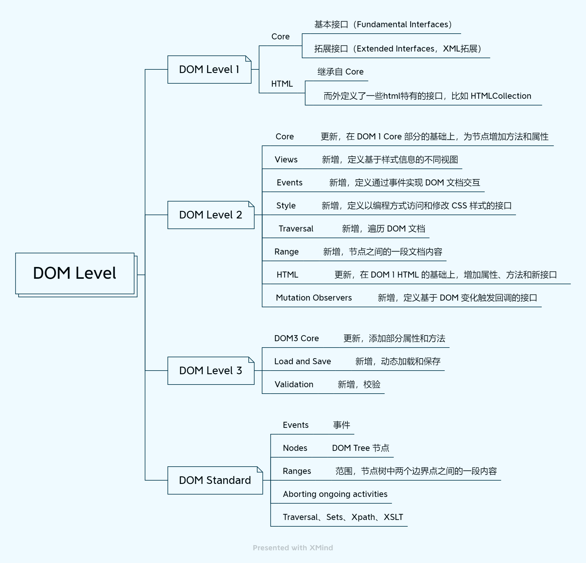

## 定义

DOM 全称（文档对象模型，Document Object Model），它只是一种模型，DOM 规范是对这种模型的描述。它告诉我们该如何对文档进行访问和修改。这种模型适用于 HTML 和 XML 类型的文档。

DOM 模型用一个树结构来表示一个文档，树的每个分支的终点都是一个节点 (node)，每个节点都是包含属性和方法的对象 (objects)。DOM 的方法 (methods) 让你可以用特定方式操作这个树，用这些方法你可以改变文档的结构、样式或者内容。节点可以关联上事件处理器，一旦某一事件被触发了，那些事件处理器就会被执行。

前端平时常说的 DOM 对象其实是通过 JS 对 DOM 接口的一种实现，**DOM 对象就是 JS 对象，也是使用原型继承**。

## 历史

DOM 曾经使用 Level 来命名，一直到 Level 3，标准文件维护在 [w3c 网站](https://www.w3.org/TR/?title=dom)。Level 4 时修改为 DOM Stand，维护在 [WHATWG 网站](https://dom.spec.whatwg.org/)。



## DOM 节点

### 节点层级（hierarchy）

下面这个列表可以用来表示**不同类型**节点间的层级（继承）关系：

- EventTarget
  - Window（特殊，单独分析）
  - Node（基础节点类型）
    - Document（DOM Tree 的根节点）
      - HTMLDocument（对 Document 进行了拓展）
      - document（常用，HTMLDocument 的实例）
    - DocumentType（文档类型节点）
    - Attr（属性节点）
    - CharacterData
      - Text
      - Comment
      - CDATASection
    - DocumentFragment
    - Element
      - SVGElement
      - HTMLElement
        - HTMLCanvasElement（注意这个和 SVG 的区别）
        - HTMLInputElement
        - HTMLBodyElement
        - ...（太多了，不一一列举）

详细说明几个重要的节点类型：

- **EventTarget**：作为基础的抽象类（构造函数），所有的节点都继承自它，以便所有的节点都支持“事件”。事件的方法绑定在 EventTarget 的 prototype 对象上。
- **Node 类型**：DOM Level 1 定义的最基本的节点类型，拥有一些所有节点共有的属性和方法，继承自 EventTarget。
  - 不同类型的节点使用 nodeType 属性来标识，常见的 nodeType：`1: 元素节点`，`3: 文本节点`， `9: Document 节点`
- **Document 类型**：浏览器中网页的根节点，也是 DOM Tree 的根节点，将文档中的其他元素都包含在内。提供了一些文档层面的通用属性与方法。
  - 与`document`对象的关系：继承关系，`document > HTMLDocument > Document > Node`。`document`对象实际上是`HTMLDocument()`构造函数的实例，每个文档只有一个。
  - 某些属性和方法是 document 特有的，没有局部版本，比如`getElementBtId()`、domain。
- **Attr**：DOM 4 中的 Attr 类型将不再继承 Node 类型，有可能废弃，不建议使用。
- **CharacterData**：一个抽象接口，没有这个类型的对象。继承关系：`Text/Comment/CDATASection > CharacterData > Node`
- **DocumentFragment**：文档片段接口，一个没有父对象的最小文档对象。它被作为一个轻量版的 Document 对象使用。不存在与 DOM Tree 中，不会触发 reflow。
- **HTMLElement**：HTMLElement 类下面其实就是各个 html 标签对应的类了，几乎每个标签都有自己单独的类，有特定的属性和方法。

我们可以尝试在 Chrome 的控制台打印一个 ul 节点，由此可以来看一下 Chrome 是如何处理节点间的继承关系的。

```yaml
# 一个 ul 节点在浏览器控制台输出的内容（简化版）
nodeName: "UL",
nodeType: 1,
nodeValue: null,
...
[[prototype]]: HTMLUListElement
  constructor: HTMLUListElement()
  ...
  # 特定的 ul 类型的节点
  [[Prototype]]: HTMLElement
    constructor: HTMLElement()
    blur: blur()
    click: click()
    focus: focus()
    innerText: ""
    ...
    # HTMLElement 构造函数的原型对象上挂载了很多 HTML 元素自有的属性和方法
    # 结合上图可知，这些属性和方法在 SVG 中是不可用的
    [[Prototype]]: Element
      constructor: Element()
      getElementsByClassName: getElementsByClassName()
      getElementsByTagName: getElementsByTagName()
      querySelector: querySelector()
      querySelectorAll: querySelectorAll()
      ...
      # Element 构造函数的原型对象上也挂载了很多共有的属性和方法，且在 SVG 中也是可用的
      [[Prototype]]: Node
        constructor: Node()
        nodeName: "UL"
        nodeType: 1
        appendChild: appendChild()
        ...
        # Node 类型是最基本的类型，有一些 DOM 节点最基本的共有属性和方法
        [[Prototype]]: EventTarget
          constructor: EventTarget()
          addEventListener: addEventListener()
          dispatchEvent: dispatchEvent()
          removeEventListener: removeEventListener()
          # EventTarget 对象用来处理事件，只挂载了这三个方法
          [[Prototype]]: Object
            constructor: Object()
            hasOwnProperty: hasOwnProperty()
            isPrototypeOf: isPrototypeOf()
            ...
```

:::tip
上面代码打印时使用的是`console.dir()`方法。

大多数浏览器在其开发者工具中支持两个命令：`console.log`和`console.dir`. 他们将参数输出到控制台。对于 JavaScript 对象，这些命令通常执行相同的操作。但对于 DOM 元素，它们是不同的：

- `console.log()`显示 DOM Tree。
- `console.dir()`显示为 DOM 对象。
:::

## 参考

- [文档对象模型 - MDN](https://developer.mozilla.org/zh-CN/docs/Web/API/Document_Object_Model)
- [javascript.info](https://javascript.info/basic-dom-node-properties#dom-node-classes)