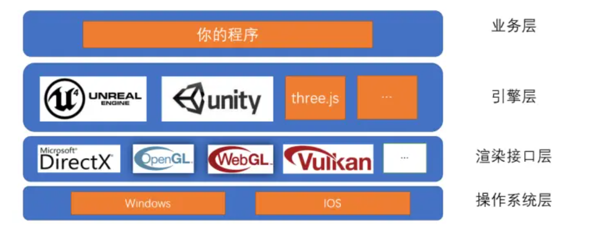
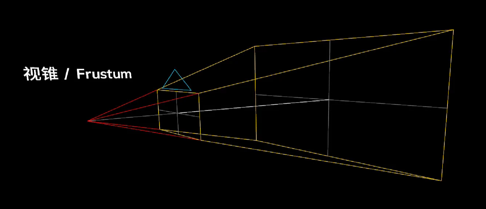
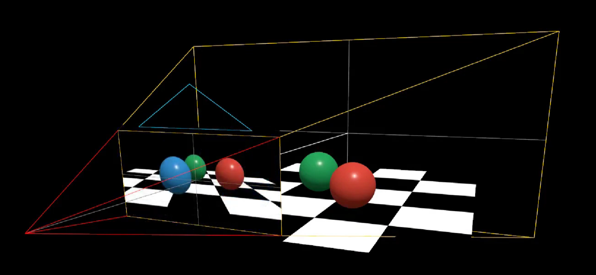
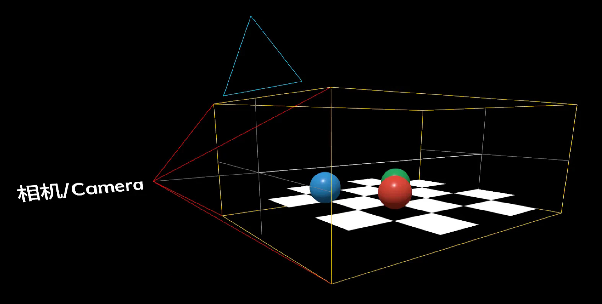

## 历史

之前的三维程序都是运行在 OpenGL 和微软公司的 DirectX 上的，PC 端大型游戏都是在此基础上开发的。随着移动技术的发展，手机上有了许多使用三维程序的场景，所以 OpenGL 标准委员会就在之前的 OpenGL 基础上开发了一个缩减版的 OpenGL 叫做 OpenGL ES，目前智能手机操作系统都是基于 OpenGL ES 来开发三维程序的。

同时为了能在浏览器上运行三维程序，就在 OpenGL ES 2.0 的基础上开发出了 WebGL 标准，把 JavaScript 和 OpenGL ES 2.0 绑定起来。WebGL 可以为 HTML5-Canvas 提供硬件 3D 加速渲染，这样 Web 开发人员就可以借助系统显卡来在浏览器里更流畅的展示 3D 场景和模型了。

WebGL 的功能很强大，但是还是偏底层，开发时非常复杂且容易出错，Three.js 就是把 WebGL 包装了一层，可以让我们方便快速的实现常见功能。

Three.js 常见功能：

- 创建简单和复杂的三维几何图像
- 在三维场景下创建和移动物体
- 为物体添加纹理和材质
- 使用各种光源来装饰场景
- 加载三维软件所创建的模型
- 使用自定义的着色器
- 创建虚拟现实 (VR) 和增强现实 (AR) 场景
- 为三维场景添加高级的后期处理效果
- 创建点云（粒子系统）

## 3D 美术知识

使用 Three.js 开发 3D 程序需要两方面的核心知识：

- 3D 美术知识：相机、光源、mesh、geomerty、material 等等，这些知识不止在 3D 程序中会用到，建模等场景也会使用，基础美术能力决定了你对 3D 的了解。计算机图形学也是用的这一套，可能会加入一些数学方面的知识。
- JS 编程能力：知道如何使用 JS 进行面向对象编程，构建程序的时候，如何做到清晰的模块化，代码该如何组织，数据和视图如何绑定等等。

下面是 3D 美术中的一些基础知识：

1. **场景 (Scene)**：是物体、光源等元素的容器，可以配合 chrome 插件使用，抛出 window.scene 即可实时调整 obj 的信息和材质信息；
2. **相机 (Camera)**：场景中的相机，代替人眼去观察，场景中只能添加一个；
4. **物体对象 (Mesh)**：包括二维物体（点、线、面）、三维物体，模型等等；
5. **光源 (Light)**：场景中的光照，如果不添加光照场景将会是一片漆黑，包括全局光、平行光、点光源等；
6. **渲染器 (Renderer)**: 场景的渲染方式，如 webGL\canvas2D\Css3D；
7. **控制器 (Control)**: 可通过键盘、鼠标控制相机的移动

## 对应的 Three.js 中的功能

### 场景 (Scene)

场景能够让你在什么地方、摆放什么东西来交给 three.js 来渲染，这是你放置物体、灯光和摄像机的地方。

### 相机 (Camera)

threejs 中常用的相机有两种，透视相机和正交相机：

**透视相机 (PerspectiveCamera)**

模拟人眼，近大远小，更适合 3D 渲染；

我们在创建透视相机的时候，需要定义一个视锥 (Frustum)，随后在渲染的时候，计算机会将视锥中的所有三维物体投影到我们的二维屏幕上。

**正交相机 (OrthographicCamera)**

物体尺寸与镜头远近无关，主要被应用在 CAD 等这种需要精确测量物体尺寸的应用场景中；

正交相机的视锥是一个长方体：

### 物体对象 (Mesh)

在计算机的世界里，一条弧线是由有限个点构成的有限条线段连接得到的。当线段数量越多，长度就越短，当达到你无法察觉这是线段时，一条平滑的弧线就出现了。 计算机的三维模型也是类似的。只不过线段变成了平面，空间中确定一个平面最少需要三个点，所以普遍用三角形组成的网格来描述。我们把这种模型称之为 Mesh 模型。

在 threejs 中，Mesh = Geometry （几何体） + Material （材质） 。Geometry 就好像是骨架，材质则类似于皮肤。

threejs 中内置了许多基本的几何图元 (Primitives)，命名全部以`Geometry`结尾，我们可以使用这些图元快速创建常见的 Geometry：

| 名称                | 类型   |
| ------------------- | ------ |
| BoxGeometry         | 立方体 |
| CircleGeometry      | 圆形   |
| ConeGeometry        | 圆锥体 |
| CylinderGeometry    | 圆柱体 |
| SphereGeometry      | 球体   |
| TetrahedronGeometry | 四面体 |
| TorusGeometry       | 圆环体 |

Material 代表三维物体的材质，不同的材质在光照下会呈现不一样的效果，通过材质，我们可以给物体设置不同的颜色、光泽度、贴图等等。

同样的，threejs 中内置了一些常用的材质函数：

| 名称                 | 类型                         |
| -------------------- | ---------------------------- |
| PointsMaterial       | 点                           |
| LineBasicMaterial    | 实线                         |
| LineDashedMaterial   | 虚线                         |
| MeshBasicMaterial    | 基础网格                     |
| MeshPhongMaterial    | Phong 网格（镜面高光）       |
| MeshLambertMaterial  | Lambert 网格（非镜面高光）   |
| MeshStandardMaterial | 标准物理网格（逼真，耗性能） |
| MeshPhysicalMaterial | 物理网格（逼真，耗性能）     |
| MeshToonMaterial     | 卡通效果                     |

### 光源 (Light)

| 名称             | 类型          |
| ---------------- | ------------- |
| AmbientLight     | 环境光        |
| PointLight       | 点光源        |
| SpotLight        | 聚光灯        |
| DirectionalLight | 平行光        |
| HemisphereLight  | 自然光/半球光 |
| RectAreaLight    | 平面光        |

### 渲染器 (Renderer)

webGL 最常用。

## Three.js 中的其他功能

### 加载外部模型

除了自建立方体之外，我们还可以加载外部模型，比如 C4D、3DMax 等创建好的复杂模型。

加载外部模型，是通过 Three.js 加载器 (Loader) 实现的，每个加载器对应某种特定的文件格式。加载器把文本/二进制的模型文件转化为 Three.js 对象结构。 

### 动画

todo

### 粒子

todo

## 参考

- [three.js 入门教程（合集）](https://www.bilibili.com/video/BV1g44y1L7np?spm_id_from=333.337.search-card.all.click)
- [WebGL 技术储备指南](https://juejin.cn/post/6844903425272987662)
- [DirectX 和 OpenGL - 极客湾](https://www.youtube.com/watch?v=3OYNerkxI-U&ab_channel=%E6%9E%81%E5%AE%A2%E6%B9%BEGeekerwan)
- [快速上手 Three.js - 奇乐编程学院](https://www.bilibili.com/video/BV1zU4y1L7Go?spm_id_from=333.999.0.0)
- [puxiao - Github](https://github.com/puxiao/threejs-tutorial)