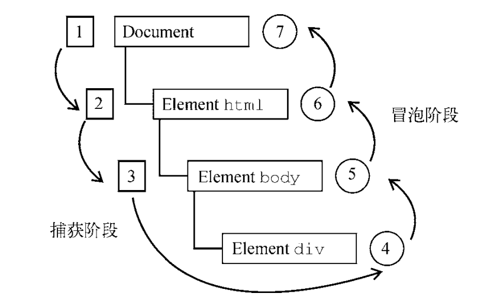

## 定义

事件就是用户或浏览器在某一时刻执行的某种动作，JavaScript 与 HTML 的交互是通过事件实现的。是一种内置在浏览器中的 API。

## 事件流

DOM2 Events 规范规定事件流分为 3 个阶段：`事件捕获`、`到达目标`和`事件冒泡`。事件捕获最先发生，为提前拦截事件提供了可能。然后，实际的目标元素接收到事件。最后一个阶段是冒泡，最迟要在这个阶段响应事件。



在 DOM 事件流中，实际的目标（ `<div>`元素）在捕获阶段不会接收到事件。这是因为捕获阶段从 document 到`<html>`再到`<body>`就结束了。下一阶段，即会在`<div>`元素上触发事件的“到达目标”阶段，通常在事件处理时被认为是冒泡阶段的一部分。

## 事件处理程序

为响应事件而调用的函数被称为事件处理程序（或事件监听器）。事件处理程序的名字以"on"开头。

事件的三种使用方式：

- **行内事件处理器**

```html
<div onclick="console.log('Clicked')"></div>
```

- **DOM0 级事件处理程序**

把一个函数赋值给（DOM 元素的）一个事件处理程序属性。

```js
let btn = document.getElementById("myBtn");
btn.onclick = function() {
  console.log("Clicked");
};
```

- **DOM2 级事件处理程序**

DOM2 Events 为事件处理程序的赋值和移除定义了两个方法： `addEventListener()` 和 `removeEventListener()`。这两个方法暴露在所有 DOM 节点上，它们接收 3 个参数：事件名、事件处理函数和一个布尔值， true 表示在捕获阶段调用事件处理程序， false（默认值）表示在冒泡阶段调用事件处理程序。

```js
let btn = document.getElementById("myBtn");
btn.addEventListener("click", () => {
  console.log(this.id);
}, false);
```

优点：可绑定多个事件。

## 事件对象

在 DOM 中发生事件时，所有相关信息都会被收集并存储在一个名为 event 的对象中。event 对象是传给事件处理程序的唯一参数。不管以哪种方式使用事件，都会传入这个 event 对象。

在事件处理程序内部， `this` 对象始终等于 `currentTarget` 的值，表示注册事件的元素，而 `target` 表示事件的实际目标。

举例：我们在 body 元素上绑定一个 click 事件，然后点击文档中的一个按钮 myBtn：

```js
document.body.onclick = function(event) {
  console.log(event.currentTarget === document.body); // true
  console.log(this === document.body); // true
  console.log(event.target === document.getElementById("myBtn")); // true
};
```

### 阻止默认行为

`preventDefault()`方法用于阻止特定事件的默认动作。比如，链接的默认行为就是在被单击时导航到 href 属性指定的 URL。如果想阻止这个导航行为，可以在 onclick 事件处理程序中取消。

```js
let link = document.getElementById("myLink");
link.onclick = function(event) {
  event.preventDefault();
};
```

### 阻止冒泡

`stopPropagation()`方法用于立即阻止事件流在 DOM 结构中传播，取消后续的事件捕获或冒泡。例如，直接添加到按钮的事件处理程序中调用 `stopPropagation()`，可以阻止 document.body 上注册的事件处理程序执行。

```js
let btn = document.getElementById("myBtn");
btn.onclick = function(event) {
  console.log("Clicked");
event.stopPropagation();
};
document.body.onclick = function(event) {
  console.log("Body clicked"); // 不执行
};
```

### 事件委托

冒泡的特点可以让我们使用**事件委托**来优化性能。

一个很好的例子是一个列表项，如果你想让每个列表项被点击时弹出一条信息，您可以将 click 单击事件绑定在父元素`<ul>`上，这样事件就会从列表项冒泡到其父元素`<ul>`上，而不必再为每个子节点单独绑定事件。

## 事件类型

事件的类型决定了事件对象 event 中会保存什么信息。 DOM3 Events 定义了如下事件类型：

- 用户界面事件 (UIEvent)：涉及与 BOM 交互的通用浏览器事件。
- 焦点事件 (FocusEvent)：在元素获得和失去焦点时触发。
- 鼠标事件 (MouseEvent)：使用鼠标在页面上执行某些操作时触发。
- 滚轮事件 (WheelEvent)：使用鼠标滚轮（或类似设备）时触发。
- 输入事件 (InputEvent)：向文档中输入文本时触发。
- 键盘事件 (KeyboardEvent)：使用键盘在页面上执行某些操作时触发。
- 合成事件 ( CompositionEvent)：在使用某种 IME（Input Method Editor，输入法编辑器）输入字符时触发。

不同类型的事件都有一个事件对象，绑定了一些特有的属性和方法，但是都是继承自 Event 对象，下面的列表展示了他们之间的关系：

- Event
  - UIEvent
    - MouseEvent
    - TouchEvent
    - FocusEvent
    - KeyboardEvent
    - WheelEvent
    - InputEvent
    - CompositionEvent
  - MessageEvent
  - SVGEvent
  - ...（不一一列出，可参考 [MDN](https://developer.mozilla.org/zh-CN/docs/Web/API/Event#%E5%9F%BA%E4%BA%8E_event_%E7%9A%84%E6%8E%A5%E5%8F%A3)）

我们可以尝试给页面上的一个 input 元素绑定一个 focus 事件，打印一下 event 对象：

```yaml
bubbles: false
cancelBubble: false
cancelable: false
type: "focus"
...
[[Prototype]]: FocusEvent
  constructor: FocusEvent()
  bubbles: false
  cancelBubble: false
  cancelable: false
  ...
  [[Prototype]]: UIEvent
    constructor: UIEvent()
    view: Window
    which: 0
    ...
    [[Prototype]]: Event
      constructor: Event()
      bubbles: false
      cancelBubble: false
      cancelable: false
      currentTarget: null
      stopPropagation: stopPropagation()
      preventDefault: preventDefault()
      ...
      [[Prototype]]: Object
        constructor: Object()
        hasOwnProperty: hasOwnProperty()
        isPrototypeOf: isPrototypeOf()
        ...
```

### 常见事件类型

todo

### 不常见和非标准事件

todo

## GlobalEventHandlers

在 [事件处理程序](#事件处理程序)这一节我们有讲到 **DOM 0 事件处理程序**，这里的事件名称都以`on`开头，跟我们上面讲到的不带`on`的事件并不是一回事。不带`on`的 events 是在 DOM 2 规范中确认下来的，而以`on`开头的事件们是在 DOM 规范出现之前就有的。

现在这些以`on`开头的事件们被放在一个叫做 GlobalEventHandlers 的集合中，并被混入和实现在 HTMLElement, Document, Window 对象上。它不是一个构造函数，不能直接创建实例，也不在 DOM 对象的原型链中，完全是为了兼容 DOM 0 时候的写法。

下面列举一些**常见的**以`on`开头的事件：

### onerror

error 事件发生时，就会调用 onerror 属性指定的回调函数。

error 事件分成两种。

一种是 JavaScript 的运行时错误，这会传到 window 对象，导致 `window.onerror()`。

```js
window.onerror = function (message, source, lineno, colno, error) {
  // ...
}
```

另一种是资源加载错误，比如``或`<script>`加载的资源出现加载错误。这时，Error 对象会传到对应的元素，导致该元素的 onerror 属性开始执行。

```js
element.onerror = function (event) {
  // ...
}
```

### onload、onloadstart

元素完成加载时，会触发 load 事件，执行`onload()`。它的典型使用场景是 window 对象和``元素。对于 window 对象来说，只有页面的所有资源加载完成（包括图片、脚本、样式表、字体等所有外部资源），才会触发 load 事件。

以下元素加载完成时都会触发 onload 事件：

```html
<frame>, <frameset>, <iframe>, 
<body>, <link>, <script>, <style>
, <input type="image">, 
```

对于``和`<video>`等元素，加载开始时还会触发 loadstart 事件，导致执行 onloadstart。

### onfocus，onblur

元素获得焦点、失去焦点时触发的事件。

注意，如果不是可以接受用户输入的元素，要触发 onfocus，该元素必须有 tabindex 属性。

### onscroll

页面或元素滚动时，会触发 scroll 事件，导致执行`onscroll()`。

### oncontextmenu，onshow

用户在页面上按下鼠标的右键，会触发 contextmenu 事件，导致执行 `oncontextmenu()`。如果该属性执行后返回 false，就等于禁止了右键菜单。document.oncontextmenu 与 window.oncontextmenu 效果一样。

```js
document.oncontextmenu = function () {
  return false;
};
```

上面代码中，oncontextmenu 属性执行后返回 false，右键菜单就不会出现。

元素的右键菜单显示时，会触发该元素的 onshow 监听函数。